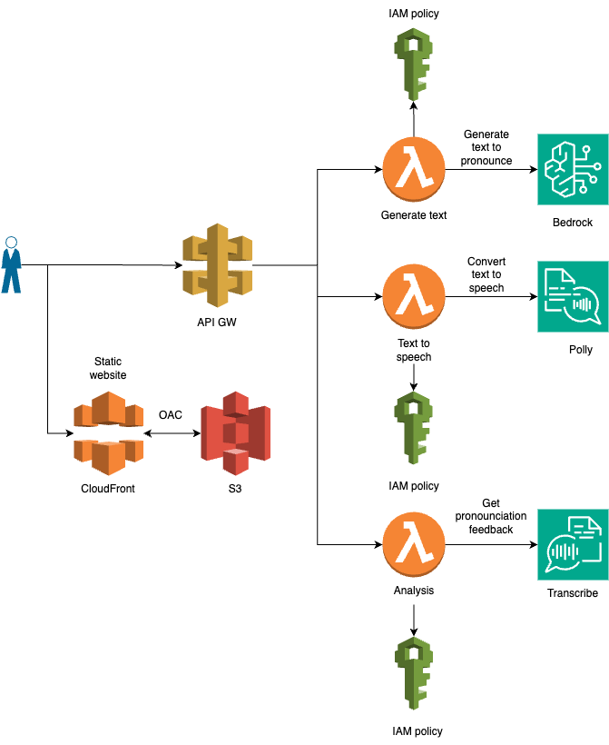
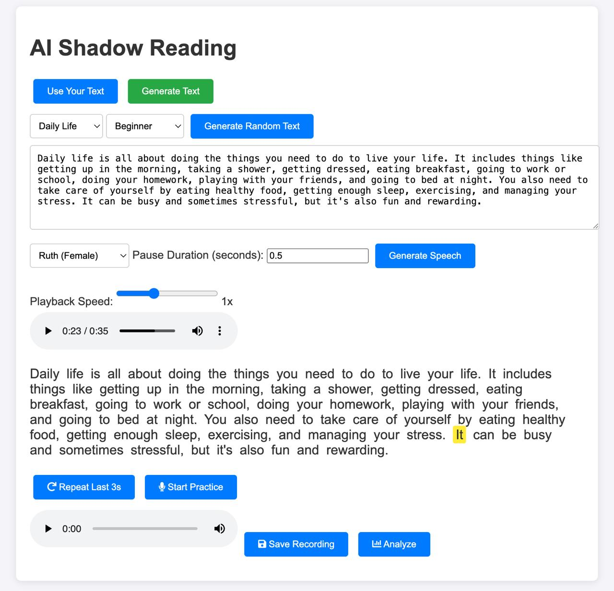

# AI Shadow Reading

## Shadow reading, also known as shadow listening or shadowing, is a language learning technique where a learner simultaneously listens to and reads a text aloud, essentially mimicking the speaker's voice. It's a form of oral practice that can improve pronunciation, fluency, and confidence in speaking a new language. 

An interactive web application that helps users improve their English pronunciation by:
1. Generating practice texts
2. Providing native speaker audio samples
3. Recording and analyzing user pronunciation
4. Giving feedback on pronunciation accuracy

## Architecture Diagram



### Key Components:

1. **Frontend (Static Web App)**
   - Built with HTML, CSS, and vanilla JavaScript
   - Hosted on S3 with CloudFront CDN
   - Features:
     - Text generation interface
     - Audio recording capabilities
     - Pronunciation analysis feedback

2. **Backend Services**
   - **API Gateway**: Routes requests to appropriate Lambda functions
   - **Generate Text Lambda**: Uses Amazon Bedrock to generate practice texts
   - **Generate Audio Lambda**: Uses Amazon Polly to generate audio from text
   - **Analysis Lambda**: Handles audio processing and pronunciation analysis
   - **S3 Bucket**: Stores audio recordings and transcription results

3. **AI Services**
   - **Amazon Bedrock (Titan Text)**: Generates practice texts based on topics/difficulty
   - **Amazon Transcribe**: Converts user speech to text for pronunciation analysis

## Getting Started

### Prerequisites
- Node.js 18+
- AWS CDK 2.x
- AWS CLI configured with credentials
- Access to AWS Bedrock model `amazon.titan-text-express-v1`
### Deployment
```bash
# Install dependencies
npm install

# Bootstrap account
cdk bootstrap

# Deploy infrastructure
cdk deploy
```

## Update Frontend API Endpoint

Update the `API_ENDPOINT` variable in `frontend/app.js` with the API Gateway endpoint from the deployment output. Line 39

```
- const API_ENDPOINT = '<API_GATEWAY_ENDPOINT>';
+ const API_ENDPOINT = 'https://abc123.execute-api.us-east-1.amazonaws.com/';
```

## And deploy infrastructure again to apply frontend changes

```
cdk deploy
```
## Key Features

- **Text Generation**:
  - Custom topics and difficulty levels
  - Random text generation
  - Integration with Amazon Bedrock

- **Pronunciation Analysis**:
  - Web-based audio recording
  - Speech-to-text conversion
  - Word-level pronunciation scoring
  - Detailed feedback report

## Environment Variables

| Variable | Description |
|----------|-------------|
| `RECORDINGS_BUCKET` | S3 bucket for audio storage |
| `TRANSCRIBE_REGION` | AWS region for Transcribe service |
| `TRANSCRIBE_ROLE_ARN` | IAM role for Transcribe jobs |

## API Endpoints

- `POST /generate-text` - Generate practice text
- `POST /analyze` - Analyze pronunciation
- `GET /shadow-reading` - Get shadow reading content

## Development Commands

* `npm run build`   compile typescript to js
* `npm run watch`   watch for changes and compile
* `npm run test`    perform the jest unit tests
* `npx cdk deploy`  deploy this stack to your default AWS account/region
* `npx cdk diff`    compare deployed stack with current state
* `npx cdk synth`   emits the synthesized CloudFormation template

## Future Enhancements

- Real-time pronunciation feedback
- Multi-language support
- Progress tracking
- Mobile app version
